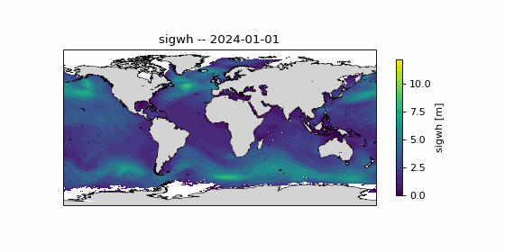
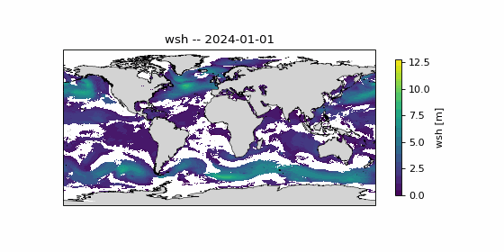
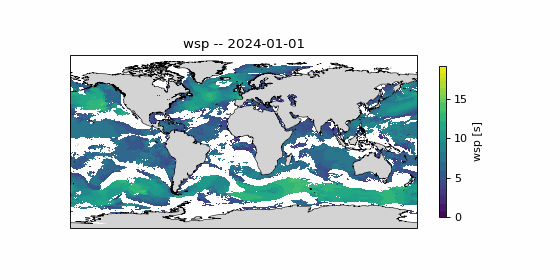
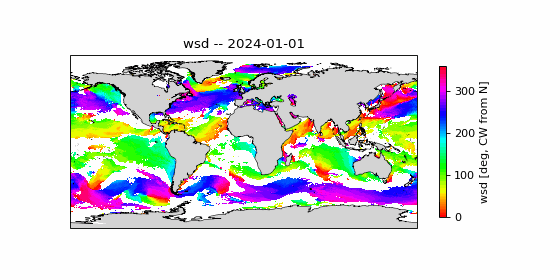
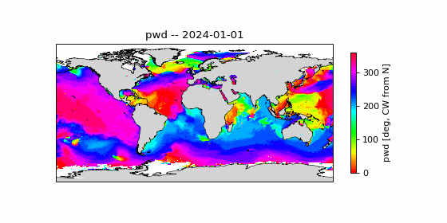
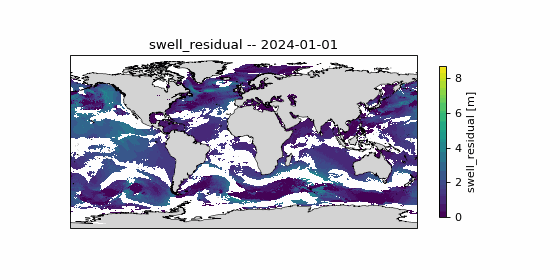
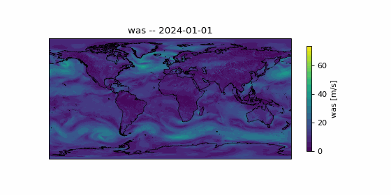
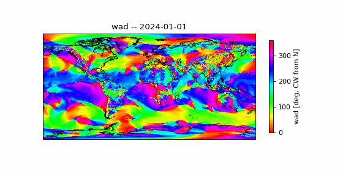

# weather-daily-avg

**Physically rigorous daily energy-averaging of GFS-Wave / WAVEWATCH III gridded fields for
maritime routing heuristics.**

**Related documents:**
- [`summary.md`](summary.md) — concise conceptual explainer of the algorithm (grids, the row-0
  = south convention, and the per-day averaging math), without the operational/build detail
  this README also covers.
- [`average_weather_description.md`](average_weather_description.md) — consumer-facing
  reference for a specific production run: field calculations plus the full per-day file
  manifest, intended to be handed to a downstream system consuming the output grids.
- [`slides.md`](slides.md) — slide-deck text (math rationale, daily-average mechanics, output
  artifacts) for presenting this pipeline to others.

---

## Project Status

- **Pipeline:** implemented and complete. `weather_daily_avg` ingests the mixed wave/wind grid
  archive, decodes `float16`/`int8` inputs, and produces all 8 output fields (`sigwh`, `wsh`,
  `wsp`, `wsd`, `was`, `wad`, `pwd`, `swell_residual`) per day.
- **Tests:** 33 GoogleTest cases passing (`ctest --test-dir build`), covering averaging math,
  grid geo-constants, I/O dtype handling, and end-to-end daily-average composition.
- **Production run:** the full 2024 calendar year (366/366 days) has been processed end-to-end
  from the real S3-mirrored archive and written to the external data disk — see
  [`average_weather_description.md`](average_weather_description.md) for the file manifest and
  exact output location.
- **Visualization:** full-year (366-frame) animated GIFs for all 8 output fields are checked into
  [`gifs/`](gifs/) — see Section 9.
- **Open items:** none currently tracked; `wad`/`pwd` are produced for a downstream consumer in
  another repository and are not validated against that consumer here.

---

## Table of Contents

0. [Project Status](#project-status)
1. [Motivation and Physical Context](#1-motivation-and-physical-context)
2. [Input Data Description](#2-input-data-description)
3. [Output Fields and Semantic Definitions](#3-output-fields-and-semantic-definitions)
4. [Mathematical Derivations](#4-mathematical-derivations)
   - 4.0 [General Principle: Energy-Equivalence as an L2 Norm](#40-general-principle-energy-equivalence-as-an-l2-norm)
   - 4.1 [Why Arithmetic Mean is Wrong for Wave Height](#41-why-arithmetic-mean-is-wrong-for-wave-height)
   - 4.2 [Energy-Averaged Significant Wave Height](#42-energy-averaged-significant-wave-height)
   - 4.3 [Energy-Weighted Period](#43-energy-weighted-period)
   - 4.4 [Energy-Weighted Direction: Circular Statistics](#44-energy-weighted-direction-circular-statistics)
   - 4.5 [Wind Speed: Drag-Equivalent Average](#45-wind-speed-drag-equivalent-average)
   - 4.6 [Swell Residual: Non-Local Wave Energy](#46-swell-residual-non-local-wave-energy)
   - 4.7 [Wind and Peak-Wave Direction: Additional Energy-Weighted Circular Means](#47-wind-and-peak-wave-direction-additional-energy-weighted-circular-means)
5. [NaN Policy and Land Masking](#5-nan-policy-and-land-masking)
6. [Usage](#6-usage)
7. [Building](#7-building)
8. [S3 Data Acquisition](#8-s3-data-acquisition)
9. [Visualization](#9-visualization)
10. [References](#10-references)

---

## 1. Motivation and Physical Context

Maritime routing engines compute optimal ship tracks by assigning costs (or equivalently,
traversal weights) to edges of a sailability graph, where each node is a spatial grid point and
each edge represents a candidate ship transit between two nodes at a given time. The edge weight
encodes the *expected resistance* the ship will encounter due to sea-state conditions, which
primarily manifests as **added resistance in waves** and **wind-induced aerodynamic drag** on
the hull and superstructure.

Both of these resistance terms are nonlinear in the forcing fields:

- Added resistance in waves scales as `R_waves ∝ H_s²` (significant wave height squared) for
  moderate sea states under linear wave theory (Salvesen 1978; Faltinsen 1990), with period and
  heading dependence entering through the Response Amplitude Operator (RAO) of the hull form.
- Wind drag scales as `F_wind ∝ U²` (wind speed squared) via the aerodynamic drag equation
  `F = ½ ρ_air C_D A U²`.

This nonlinearity has a direct consequence for temporal averaging: **arithmetic mean of H_s or U
underestimates the physical impact** of a distribution that contains episodic high-intensity
events. A sea state that is 0 m for 6 hours and 4 m for 6 hours is not equivalent to a constant
2 m sea state; the 4 m period contributes 16× more resistance than the 2 m period per unit time,
so the representative height for resistance purposes is `sqrt(0² + 4²)/2 ≈ 2.83 m`, not 2 m.

The pipeline in this repository therefore applies **energy-based averaging** throughout, ensuring
that the daily summary fields fed to the routing heuristic correctly reflect the
resistance-weighted sea state rather than the geometrically averaged sea state.

The target temporal resolution is one set of summary fields per calendar day, derived from up to
8 hourly snapshots (00, 03, 06, 09, 12, 15, 18, 21 UTC). This resolution is appropriate for
strategic and tactical routing (day-ahead to week-ahead horizon) where sub-daily variability is
treated as aleatory uncertainty absorbed into the heuristic's tolerance for error.

---

## 2. Input Data Description

### Source

GFS-Wave (NOAA Global Forecast System - Wave component, WAVEWATCH III nested model), 0.25°
global grid, archived at 3-hourly intervals. Files are stored on AWS S3 in `.npy` (NumPy binary)
format at the path structure:

```
s3://noaa-weather-service/process/<YYYY>/<MM>/<DD>/<HH>/
```

where `HH ∈ {00, 03, 06, 09, 12, 15, 18, 21}`.

### Grid Specification

The archive does **not** use a single uniform grid across all variables. Wave-derived fields and
wind fields are stored on two different row counts, confirmed against real downloaded data
(`test_data/2024/01/01/`):

| Parameter             | Wave grid (`sigwh`, `wsh`, `wsp`, `wsd`, `pwh`, `pwd`) | Wind grid (`was`, `wad`)        |
|------------------------|--------------------------------------------|----------------------------------|
| Format                 | NumPy `.npy`, C-order (row-major)           | NumPy `.npy`, C-order (row-major)|
| On-disk dtype          | `float16` (continuous) / `int8` (direction) | `float16` (continuous) / `int8` (direction) |
| Grid type               | Regular lat/lon (equirectangular)           | Regular lat/lon (equirectangular)|
| Rows (latitude axis)    | **621**                                     | **721**                          |
| Cols (longitude axis)   | 1440                                        | 1440                             |
| Resolution              | 0.25° × 0.25°                               | 0.25° × 0.25°                    |
| Land mask               | NaN, continuous fields only (see below)     | not observed (no NaNs in `was`)  |

**Latitude offset and row order — resolved:** the `.npy` files carry no coordinate metadata, so
neither grid's row-to-latitude mapping could be assumed from shape alone — and the documented
"row 0 = 90N, increasing southward" convention turned out to be **wrong for both grids**.

- **Wave grid:** determined by rasterizing Natural Earth coastlines into a land mask, then
  correlating that mask against the real NaN (land/ice) pattern in `sigwh` across multiple
  independent days, for every plausible row offset and row order. A single sharp, consistent
  peak emerged at **~92.6% agreement** (verified visually too — continents line up with
  coastlines exactly): row 0 is the **south** end, and latitude increases **northward** with row.
  The residual ~7% mismatch is attributable to seasonal sea ice (NaN'd as "ice" in the source
  data but not part of the land-only reference mask) plus coarse coastline resolution, not
  misalignment.
- **Wind grid:** `was`/`wad` carry no NaN/land mask to correlate against, so the same technique
  doesn't directly apply. It was confirmed two other ways: (1) the same south/north landmark
  displacement artifact visible in the wave grid's raw, untransformed render is also visible in
  `was`'s raw render, and (2) independently, intense winter-storm wind signatures in `was` land
  at the row a ~45–50°N North Pacific/Atlantic cyclone should occupy under a "row 0 = south,
  increasing northward" mapping — and at an implausible Southern Ocean latitude under the
  opposite (originally-assumed) mapping. The wind grid has exactly enough rows for a full
  pole-to-pole span at 0.25° with no truncation (721 rows = (180/0.25)+1), so row 0 = 90°S and
  the last row = 90°N. **Both grids share the same row 0 = south, increasing-northward
  convention** — they are not reversed relative to each other, as an earlier version of this
  README claimed; that claim came from an unverified assumption about the wind grid which turned
  out to be wrong.

Index mapping:

```
# Wind grid (was, wad) -- row 0 = south pole, lat increases northward with row
row(lat)  = (lat - (-90.0)) / 0.25     lat ∈ [-90, 90]

# Wave grid (sigwh, wsh, wsp, wsd, pwh, pwd, swell_residual) -- row 0 = south end, lat increases northward with row
row(lat)  = (lat - (-75.0)) / 0.25     lat ∈ [-75, 80]

# Longitude (both grids)
col(lon)  = (lon % 360) / 0.25         lon ∈ [-180, 360)
```

See `config::WAVE_GRID_LAT_AT_ROW0`, `config::WIND_GRID_LAT_AT_ROW0`, and
`config::GRID_LAT_STEP_DEG` in `src/config.hpp`.

Internally, the pipeline upcasts every field to `double` immediately on load (per AGENTS.md) and
never enforces a single fixed grid size — each field's own on-disk shape is authoritative, and
the only cross-check applied is that all 8 hourly snapshots of the *same* variable agree in shape.

### Input Variables

| Filename     | Description                                    | Units   | On-disk dtype | Type   |
|--------------|------------------------------------------------|---------|----------------|--------|
| `sigwh.npy`  | Significant wave height (combined sea+swell)   | m       | float16        | Scalar |
| `wsh.npy`    | Wind sea significant wave height               | m       | float16        | Scalar |
| `wsp.npy`    | Wind sea mean wave period                      | s       | float16        | Scalar |
| `wsd.npy`    | Wind sea mean wave direction                   | degrees | **int8 code**  | Angle  |
| `was.npy`    | Wind speed at sea surface (10 m reference)     | m/s     | float16        | Scalar |
| `wad.npy`    | Wind direction at sea surface                  | degrees | **int8 code**  | Angle  |
| `pwh.npy`    | Peak wave height (loaded only to weight `pwd`; not itself output) | m | float16 | Scalar |
| `pwd.npy`    | Peak wave direction                            | degrees | **int8 code**  | Angle  |

Directional convention: meteorological "coming from", measured clockwise from geographic North
(0° = wind/waves arriving from North, 90° = from East). This is the standard GFS convention,
applied **after** decoding the on-disk direction code (see below).

#### Direction encoding: 16-point compass codes

`wsd`, `wad`, and `pwd` are **not** stored as raw degree values — they are `int8` codes for a
16-point compass rose (22.5° per step), observed directly from `test_data`:

| Field | Observed code range | Origin (North = 0°) | Decode formula                  |
|-------|----------------------|----------------------|----------------------------------|
| `wsd` | `0`–`15`              | code `0`              | `degrees = code * 22.5`           |
| `wad` | `1`–`16`              | code `1`              | `degrees = (code - 1) * 22.5`     |
| `pwd` | `0`–`15`              | code `0`              | `degrees = code * 22.5`           |

`src/averaging.{hpp,cpp}` implements this as `compass_code_to_degrees(codes, origin_code)`, applied
immediately after load and before any energy-weighted averaging.

`int8` has no NaN representation, so these fields carry no land mask of their own — land/no-data
cells are still correctly excluded because the energy-weighted circular mean (Section 4.4.2)
gates on the paired height field's NaN, not on the direction field directly.

Dropped variables (available in source but not used in this pipeline):

- `ocd.npy`, `ocs.npy`, `sst.npy` — ocean current direction/speed and sea surface temperature.
  Excluded as documented below. Observed on disk at a different, finer grid: `(1121, 2880)`,
  `float16`/`int8` — this is a third grid distinct from both the wave and wind grids above, not
  used by this pipeline, so its exact resolution/extent has not been investigated further.
  - `ocd.npy`/`ocs.npy` are excluded because the routing engine computes speed-over-ground
    corrections separately using a dedicated current atlas.
  - `sst.npy` is excluded from this pipeline; used separately in a hull-fouling and CII-rating
    pipeline.
- `pswh.npy`, `pswp.npy`, `pswd.npy` — primary swell triplet: redundant given the swell
  residual derived from `sigwh` and `wsh` (see Section 4.6).
- `pwp.npy` — peak wave period: not currently consumed by any downstream consumer.
  (`pwh.npy`/`pwd.npy` are loaded — see Input Variables above and Section 4.7 — despite `pwd`'s
  directional signal being unstable, since it tracks whichever of swell/wind-sea has peak energy
  and switches between the two unpredictably; a downstream consumer in another repository needs
  the peak-wave direction regardless.)
- `wad_come_from.npy` — present in the real archive but undocumented upstream and unused here;
  same `(721, 1440)` int8-coded grid as `wad`.

---

## 3. Output Fields and Semantic Definitions

For each calendar day and each grid cell `(i, j)`, the pipeline produces 8 output fields derived
from up to 8 hourly input snapshots:

| Output field      | Symbol          | Derivation                        | Units   | Grid shape         |
|-------------------|-----------------|------------------------------------|---------|--------------------|
| `sigwh.npy`       | `H_eff,sig`     | Energy average of sigwh           | m       | wave grid (621,1440) |
| `wsh.npy`         | `H_eff,ws`      | Energy average of wsh             | m       | wave grid (621,1440) |
| `wsp.npy`         | `T_eff,ws`      | Energy-weighted wsp                | s       | wave grid (621,1440) |
| `wsd.npy`         | `θ_eff,ws`      | Energy-weighted wsd, weight=wsh²  | degrees | wave grid (621,1440) |
| `was.npy`         | `U_eff`         | Drag-equivalent was                | m/s     | wind grid (721,1440) |
| `wad.npy`         | `θ_eff,wind`    | Energy-weighted wad, weight=was²  | degrees | wind grid (721,1440) |
| `pwd.npy`         | `θ_eff,peak`    | Energy-weighted pwd, weight=pwh²  | degrees | wave grid (621,1440) |
| `swell_residual`  | `H_swell`       | Derived from sigwh/wsh             | m       | wave grid (621,1440) |

`pwh` is loaded only to weight `pwd`'s energy-weighted circular mean — it is not itself an
output field (see Section 4.7).

All output fields are written as `float64`, regardless of the on-disk dtype of the corresponding
input field — see Section 2 for why inputs are `float16`/`int8` but internal math (and therefore
output precision) stays `double` throughout, per AGENTS.md.

The mathematical definitions of each are given in Section 4.

---

## 4. Mathematical Derivations

### 4.0 General Principle: Energy-Equivalence as an L2 Norm

Every "average" in this pipeline is a special case of one underlying principle. Let `φ(x)` be
the physical quantity that actually matters for the routing heuristic (resistance or drag), and
suppose `φ` is quadratic in the forcing variable: `φ(x) = k·x²` for some constant `k` (waves:
`k ∝ ρ_w g`; wind: `k = ½ ρ_air C_D A`). Given a sequence of instantaneous values `{x_t}` over a
day, the **energy-equivalent representative value** `x_eff` is defined as the constant that
reproduces the same total `φ`-impulse:

```
Σ_t φ(x_t)  =  N · φ(x_eff)
⟺  Σ_t x_t²  =  N · x_eff²
⟺  x_eff  =  sqrt( (1/N) Σ_t x_t² )  =  ‖x‖_2 / sqrt(N)
```

i.e. `x_eff` is the (normalized) **L2 norm** of the sequence, not the L1-normalized arithmetic
mean. This single definition specializes to every averaging rule used below:

| Section | Quantity | Specialization of the general form |
|---|---|---|
| 4.2 | `sigwh`, `wsh` heights | direct RMS: `x_eff = sqrt(mean(x_t²))` |
| 4.3 | `wsp` period | period is not itself squared in `φ`; instead it is *weighted* by the energy proxy `H_t²` of its paired height — a weighted-L1 mean of `T`, with weights drawn from the L2 structure of `H` |
| 4.4 | `wsd`/`wad`/`pwd` direction | the L2-norm argument is applied component-wise (sin/cos) before taking the circular `atan2`, weighted by the paired field's energy proxy |
| 4.5 | `was` wind speed | direct RMS, same as 4.2 with `φ = ½ρC_DAU²` |
| 4.6 | `swell_residual` | not an independent average — derived by inverting the L2 superposition `H_total² = H_ws² + H_swell²` |

By the QM-AM (quadratic-mean / arithmetic-mean) inequality, `x_eff ≥ mean(x_t)` always, with
equality only when `{x_t}` is constant — so this substitution can only ever *increase* the
estimated resistance/drag relative to a naive arithmetic mean, never decrease it; see the worked
example in Section 4.1 for the magnitude of that correction.

### 4.1 Why Arithmetic Mean is Wrong for Wave Height

Let `{H_t}` for `t = 1, ..., N` be a sequence of significant wave height observations at a grid
cell over one day. The added resistance in waves for a ship is, in the linear regime:

```
R_waves(t) ∝ H_t²
```

The total added resistance-impulse over the day is proportional to `Σ H_t²`. The "representative"
constant sea state `H_eff` that produces the same total resistance-impulse satisfies:

```
N · H_eff² = Σ H_t²

⟹  H_eff = sqrt( (1/N) · Σ H_t² )
```

This is the **root-mean-square (RMS)** or **quadratic mean** of `{H_t}`. It is always ≥ the
arithmetic mean (by the QM-AM inequality), with equality only when all `H_t` are identical.

Compare for the example above (`H = [0, 4]` m):

```
Arithmetic mean:  (0 + 4) / 2            = 2.00 m
Energy average:   sqrt((0² + 4²) / 2)    = 2.83 m
```

The ratio of implied resistances:

```
R(2.83) / R(2.00) = 2.83² / 2.00² = 8 / 4 = 2.0
```

Using the arithmetic mean would **halve the estimated resistance** of the representative sea
state in this example — a 100% error in the resistance heuristic.

### 4.2 Energy-Averaged Significant Wave Height

For a grid cell `(i,j)` with `N` valid (non-NaN) hourly snapshots in a day:

```
H_eff(i,j) = sqrt( (1 / N_valid) · Σ_{t: H_t ≠ NaN} H_t(i,j)² )
```

where `N_valid = |{t : H_t(i,j) is not NaN}|`.

This is applied independently to `sigwh` (yielding `H_eff,sig`) and to `wsh` (yielding
`H_eff,ws`).

**Boundary case:** if `N_valid = 0` (land cell or all timesteps missing), output is NaN.

**Implementation:**

```cpp
double sum_sq = 0.0;
int count = 0;
for (int t = 0; t < N; ++t) {
    double h = H_stack[t](i, j);
    if (!std::isnan(h)) { sum_sq += h * h; ++count; }
}
double H_eff = (count > 0) ? std::sqrt(sum_sq / count) : std::nan("");
```

### 4.3 Energy-Weighted Period

Wave period cannot be energy-averaged by the same RMS formula as height, because period does not
enter the energy relation linearly in the same way. Wave energy density in deep water is:

```
E = (1/16) · ρ_w · g · H_s²
```

This is independent of period. However, **energy flux** (power per unit crest width) is:

```
P = E · c_g ≈ E · (g · T_p) / (4π)     [deep water]
```

where `c_g` is the group velocity and `T_p` is the peak period. For routing purposes, energy
flux is more relevant than energy density because it determines the rate at which wave energy
impinges on the ship's hull. The representative period that preserves total energy flux over the
day is therefore the **energy-flux-weighted mean period**:

```
T_eff(i,j) = [ Σ_{t valid} H_t² · T_t ] / [ Σ_{t valid} H_t² ]
```

This is a weighted arithmetic mean of period, with weights proportional to `H_t²` (the energy
proxy). It gives more weight to periods that occur when the sea is energetic, and zero weight to
periods that occur when `H_t = 0`.

**Boundary case:** if `Σ H_t² = 0` (all heights are zero — a calm day), the denominator is zero
and `T_eff` is undefined. In this case, `T_eff = NaN` is the correct output, since period is
physically meaningless when there are no waves.

**Implementation:**

```cpp
double sum_sq = 0.0, sum_Tw = 0.0;
for (int t = 0; t < N; ++t) {
    double h = H_stack[t](i, j);
    if (std::isnan(h)) continue;
    double w = h * h;
    sum_sq += w;
    double T = T_stack[t](i, j);
    if (!std::isnan(T)) sum_Tw += w * T;
}
double T_eff = (sum_sq > 0.0) ? sum_Tw / sum_sq : std::nan("");
```

### 4.4 Energy-Weighted Direction: Circular Statistics

Directional fields (wave direction, wind direction) are **circular quantities**: they live on
S¹ (the unit circle) rather than on ℝ. Arithmetic mean of angles is not well-defined modulo 2π:
the arithmetic mean of 359° and 1° is 180° (South), but the correct circular mean is 0°/360°
(North), since both angles are within 1° of North.

#### 4.4.1 Unweighted Circular Mean

The circular mean of a set of angles `{θ_t}` is defined as:

```
ū = (1/N) · Σ sin(θ_t)
v̄ = (1/N) · Σ cos(θ_t)

θ_mean = atan2(ū, v̄)   mod 360°
```

Note the argument order: `atan2(sin-component, cos-component)`. This is because angles in the
meteorological convention are measured clockwise from North, mapping to:

```
East component (x): sin(θ)
North component (y): cos(θ)
```

So `atan2(Σ sin, Σ cos)` correctly recovers the clockwise-from-North angle.

The **mean resultant length** `R = sqrt(ū² + v̄²) ∈ [0, 1]` measures directional concentration:
`R = 1` means all observations point in the same direction; `R = 0` means the directions cancel
completely (undefined mean — e.g., equal weights of 90° and 270°). When `R ≈ 0`, `θ_mean`
should be treated as meaningless; in this pipeline it is output as the numerical result of
`atan2` with a quality flag implied by low `H_eff` (low energy → direction matters less for
routing anyway).

#### 4.4.2 Energy-Weighted Circular Mean

For the routing heuristic, directions that occur during high-energy sea states should dominate
the representative direction. The energy-weighted circular mean uses `H_t²` as the weight:

```
ū_w = Σ_{t valid} H_t² · sin(θ_t)
v̄_w = Σ_{t valid} H_t² · cos(θ_t)

θ_eff = atan2(ū_w, v̄_w)   mod 360°
```

This generalizes the standard circular mean to a weighted version. When `H_t = 0`, that timestep
contributes zero to both sums, naturally excluding calm periods from the directional average —
consistent with physical intuition (a calm period has no meaningful wave direction).

**Implementation:**

```cpp
double sum_u = 0.0, sum_v = 0.0;
for (int t = 0; t < N; ++t) {
    double h = H_stack[t](i, j);
    double theta = dir_stack[t](i, j);
    if (std::isnan(h) || std::isnan(theta)) continue;
    double w = h * h;
    double rad = theta * M_PI / 180.0;
    sum_u += w * std::sin(rad);
    sum_v += w * std::cos(rad);
}
double theta_eff = std::fmod(
    std::atan2(sum_u, sum_v) * 180.0 / M_PI + 360.0, 360.0
);
```

The `+ 360.0` before `fmod` ensures the result is in `[0°, 360°)` even when `atan2` returns a
negative value.

### 4.5 Wind Speed: Drag-Equivalent Average

Wind aerodynamic drag on the ship is:

```
F_wind = ½ · ρ_air · C_D · A · U²
```

where `U` is wind speed, `C_D` is the drag coefficient, and `A` is the transverse projected
area. Following the same logic as Section 4.1, the representative wind speed `U_eff` that
preserves the total drag-impulse over the day is:

```
U_eff(i,j) = sqrt( (1 / N_valid) · Σ_{t valid} U_t(i,j)² )
```

This is the same RMS formula as for wave height, applied to `was` (wind speed). Wind direction
(`wad`) is **not** averaged by this RMS formula — being a directional quantity, it instead uses
the energy-weighted circular mean, weighted by `was²` (consistent with the `F_wind ∝ U²`
relation above). See Section 4.7 for the derivation; `wad` is consumed by a downstream consumer
in another repository, not by this pipeline's own routing heuristic.

### 4.6 Swell Residual: Non-Local Wave Energy

For a two-component wave spectrum (wind sea + swell), the total significant wave height satisfies
the **spectral energy superposition** relation:

```
H_s,total² ≈ H_s,ws² + H_s,swell²
```

where `H_s,total` is `sigwh` and `H_s,ws` is `wsh`. This relation holds exactly when the two
components are spectrally non-overlapping (i.e., their frequency bands do not mix), which is a
standard assumption in partitioned wave models including WAVEWATCH III.

Rearranging, the swell component height is:

```
H_swell(i,j) = sqrt( max( H_s,total(i,j)² - H_s,ws(i,j)², 0 ) )
```

The `max(..., 0)` clamp handles numerical noise: because `sigwh` and `wsh` are computed by
independent model runs (not derived from each other algebraically), floating-point rounding can
produce `wsh > sigwh` by O(10⁻¹⁰) at individual cells, which would otherwise produce a NaN
from the square root of a negative number. Clamping to zero is physically correct (implies zero
swell energy, not negative swell energy).

This `H_swell` field serves as a **swell flag** in the routing heuristic:

- `H_swell ≈ 0`: wind sea explains essentially all wave energy; conditions are locally driven and
  well-predicted by the `was`/`wad`/`wsh`/`wsp`/`wsd` fields.
- `H_swell >> 0`: significant energy from a non-local source (distant storm swell), which the
  local wind fields do not capture; the routing heuristic should increase the uncertainty margin
  on affected edges.

Note that this field does not provide the direction or period of the swell — those would require
retaining `pswd`/`pswp`, which were excluded on grounds of redundancy (see Section 2). For the
strategic routing use case, the magnitude of the swell residual alone is sufficient to modulate
the uncertainty margin without requiring full swell spectral characterization.

**Energy averaging of the swell residual** is applied after computing `H_swell` at each
timestep — but in this pipeline, `H_swell_daily` is derived from the already-daily-averaged
`sigwh_daily` and `wsh_daily` rather than being averaged itself:

```
H_swell_daily(i,j) = sqrt( max( sigwh_daily(i,j)² - wsh_daily(i,j)², 0 ) )
```

This is mathematically equivalent to first computing `H_swell_t` at each timestep and then
energy-averaging, *if and only if* all timesteps are equally valid. For days with NaN timesteps,
however, this approach uses the energy average of the available subset for both `sigwh_daily` and
`wsh_daily` independently, which is the correct treatment (consistent with the NaN-aware averaging
in Section 4.2).

### 4.7 Wind and Peak-Wave Direction: Additional Energy-Weighted Circular Means

`wad` (wind direction) and `pwd` (peak wave direction) are averaged using the same energy-weighted
circular mean as `wsd` (Section 4.4.2), generalized to:

```
u_w = Σ_{t valid} W_t² · sin(θ_t),   v_w = Σ_{t valid} W_t² · cos(θ_t)
θ_eff = atan2(u_w, v_w) mod 360
```

where the weight field `W` is chosen per-direction-field to be that field's own physically paired
energy/intensity proxy, not a generic combined-energy field like `sigwh`:

| Direction field | Weight `W` | Rationale |
|------------------|------------|-----------|
| `wsd`            | `wsh` (wind-sea height) | wsd describes the wind-sea component specifically (Section 4.4.2) |
| `wad`            | `was` (wind speed)      | mirrors `F_wind ∝ U²` (Section 4.5) — drag-relevant heading should be weighted by drag-relevant intensity |
| `pwd`            | `pwh` (peak wave height)| pwd describes whichever spectral component currently has peak energy; weighting by anything other than that component's own height (e.g. `sigwh`) would reintroduce the cross-component instability this field is known for |

`pwh` is loaded solely to compute this weight — it is **not** itself a daily-averaged output
field, since no consumer currently needs `H_eff` for the peak-wave component specifically.

`wad` and `pwd` are not consumed by this pipeline's own routing heuristic; they are produced for
a downstream consumer in another repository that needs both fields at daily resolution.

---

## 5. NaN Policy and Land Masking

The GFS-Wave model does not compute wave fields over land or sea ice. These cells are represented
as NaN in all input `.npy` files, **not as zero**. This distinction is critical:

- A NaN cell should propagate NaN in output (land remains land).
- A zero cell represents a calm sea (valid observation of zero wave height or wind speed).

Averaging functions in this pipeline use `std::isnan` guards on every accumulation. A cell is
output as NaN if and only if all input timesteps for that cell are NaN. A cell with at least one
valid non-NaN timestep is averaged over valid timesteps only; the averaging denominator
(`N_valid` or `Σ H²`) reflects only valid inputs.

Days with fewer than 2 valid hourly timesteps at a cell are treated as data-insufficient and
output NaN for that cell, regardless of the value of the valid timesteps. This threshold
(configurable via `--min-valid-hours`) prevents single-point outliers from being treated as a
representative daily average.

**Caveat for `int8`-coded direction fields (`wsd`, `wad`):** `int8` has no NaN representation, so
these fields carry no land mask of their own — observed land/no-data cells in the real archive
show up as NaN in the float16 height fields but not in the int8 direction codes. This is not a
gap in practice: the energy-weighted circular mean (Section 4.4.2) only accumulates a timestep
when *both* the height and the direction are valid, and the height field's NaN is what actually
gates land cells out of the directional average.

---

## 6. Usage

### Full run (sync data from S3, then average)

```bash
# 1. Build (see Section 7)
cmake -B build -DCMAKE_BUILD_TYPE=Release
cmake --build build -j$(nproc)

# 2. Sync data from S3 (see Section 8)
bash scripts/sync_s3.sh --years 2024 2025 --months 1 2 3 --data-dir ./data

# 3. Run averaging
./build/weather_daily_avg \
  --data-dir   ./data \
  --output-dir ./averaged \
  --years      2024 2025 \
  --months     1 2 3 \
  --threads    8
```

### Quick start: averaging a single locally-downloaded day

If you already have one or more hourly directories on disk (e.g. mirrored by hand, or via a
partial `sync_s3.sh` run) rather than the full S3 sync above, point `--data-dir` directly at the
root that contains the `<YYYY>/<MM>/<DD>/<HH>/` tree and pass just that day's year/month — the
binary scans every day in the given month(s) and silently skips any day for which it finds fewer
than `--min-valid-hours` hourly snapshots (default 2), so it is safe to point it at a directory
that only has data for one day:

```bash
./build/weather_daily_avg \
  --data-dir   ./test_data \
  --output-dir ./test_output \
  --years      2024 \
  --months     1 \
  --threads    4

# Inspect the result for 2024-01-01:
python3 -c "
import numpy as np
print(np.load('test_output/2024/01/01/sigwh.npy').shape)
print(np.load('test_output/2024/01/01/wsd.npy')[300, 700])  # degrees, 0-360 CW from N
"
```

This expects `./test_data/2024/01/01/<HH>/{sigwh,wsh,wsp,wsd,was,wad,pwh,pwd}.npy` for at least 2 of the
8 hours (`00,03,06,09,12,15,18,21`) — see Section 2 for the real on-disk format (mixed grids,
`float16`/`int8`, compass-coded directions) that `weather_daily_avg` expects and decodes.

If `--min-valid-hours` worth of hourly files aren't found for a given day, a warning is printed
to `stderr` and no output is written for that day (not an error) — check `stderr` if an expected
output file doesn't show up.

### Output structure

```
<output-dir>/
└── 2024/
    └── 01/
        └── 01/
            ├── sigwh.npy          # H_eff,sig    [m]
            ├── wsh.npy            # H_eff,ws     [m]
            ├── wsp.npy            # T_eff,ws     [s]
            ├── wsd.npy            # θ_eff,ws     [degrees, 0-360, CW from N]
            ├── was.npy            # U_eff        [m/s]
            ├── wad.npy            # θ_eff,wind   [degrees, 0-360, CW from N]
            ├── pwd.npy            # θ_eff,peak   [degrees, 0-360, CW from N]
            └── swell_residual.npy # H_swell      [m]
```

All output fields are `float64`, regardless of the on-disk dtype of the corresponding inputs.

---

## 7. Building

### Requirements

| Dependency | Version  | Notes                              |
|------------|----------|------------------------------------|
| C++ compiler | C++23  | GCC ≥ 13, Clang ≥ 17              |
| CMake      | ≥ 3.20   |                                    |
| Eigen3     | ≥ 3.4    | Via system package or manual path  |
| OpenMP     | ≥ 4.5    | Bundled with GCC, opt-in on Clang  |
| zlib       | any      | Dependency of cnpy                 |
| cnpy       | HEAD     | Included as git submodule          |
| GoogleTest | v1.14.0  | Tests only, fetched via CMake `FetchContent` (requires network access) |

```bash
# Initialize submodules
git submodule update --init --recursive

# Install system dependencies (Debian/Ubuntu)
sudo apt install libeigen3-dev zlib1g-dev

# Configure
cmake -B build \
  -DCMAKE_BUILD_TYPE=Release \
  -DCMAKE_CXX_FLAGS="-march=native" \
  -DEIGEN3_INCLUDE_DIR=/usr/include/eigen3

# Build
cmake --build build -j$(nproc)

# Test
ctest --test-dir build --output-on-failure
```

### macOS (Homebrew)

Homebrew's GCC has been observed to fail compiling GoogleTest against newer macOS SDKs (an
unrelated `mach/message.h` header incompatibility, not a problem with this codebase). AppleClang
plus Homebrew's `libomp` is the verified working toolchain:

```bash
git submodule update --init --recursive
brew install eigen libomp

cmake -B build \
  -DCMAKE_BUILD_TYPE=Release \
  -DCMAKE_CXX_COMPILER=/usr/bin/clang++ \
  -DEIGEN3_INCLUDE_DIR="$(brew --prefix eigen)/include/eigen3" \
  -DOpenMP_ROOT="$(brew --prefix libomp)"

cmake --build build -j"$(sysctl -n hw.ncpu)"
ctest --test-dir build --output-on-failure
```

---

## 8. S3 Data Acquisition

Use the provided sync script to mirror data locally before running the averaging pipeline:

```bash
bash scripts/sync_s3.sh --years 2024 2025 --months 1 2 3 --data-dir ./data
```

The script iterates over all valid calendar dates for the requested year/month combinations and
calls `aws s3 sync` for each 3-hourly prefix. Invalid dates (e.g., February 30) produce no-ops
with no error. AWS credentials must be configured in the environment before running.

Manual invocation:

```bash
for year in 2024 2025; do
  for month in $(seq -w 1 12); do
    echo "=== Starting ${year}-${month} ==="
    for day in $(seq -w 1 31); do
      for hour in 00 03 06 09 12 15 18 21; do
        aws s3 sync \
          "s3://noaa-weather-service/process/${year}/${month}/${day}/${hour}/" \
          "./data/${year}/${month}/${day}/${hour}/"
      done
    done
    echo "=== Finished ${year}-${month} ==="
  done
done
```

---

## 9. Visualization

`scripts/make_gifs.py` renders one animated GIF per output field (all 8: `sigwh`, `wsh`, `wsp`,
`wsd`, `was`, `wad`, `pwd`, `swell_residual`), animated over whatever days are present under
`--output-dir`, with coastlines and land shading so the data reads against real geography:

```bash
pip install -r scripts/requirements.txt
python3 scripts/make_gifs.py --output-dir test_output --out-dir gifs
```

The GIFs checked into [`gifs/`](gifs/) were generated from the full 2024 production run and
show one frame per week (53 frames, Jan 1 → Dec 30 2024) at reduced resolution for README
embedding. The full 366-frame versions can be regenerated with:

```bash
python3 scripts/make_gifs.py --output-dir <output-dir> --out-dir gifs
```

### Wave fields (wave grid, 621×1440)

| Significant wave height (`sigwh`) | Wind-sea height (`wsh`) |
|---|---|
|  |  |

| Wind-sea period (`wsp`) | Wind-sea direction (`wsd`) |
|---|---|
|  |  |

| Peak-wave direction (`pwd`) | Swell residual (`swell_residual`) |
|---|---|
|  |  |

### Wind fields (wind grid, 721×1440)

| Wind speed (`was`) | Wind direction (`wad`) |
|---|---|
|  |  |

Notes:

- Each grid is geo-referenced per Section 2 — the wave grid (`sigwh`/`wsh`/`wsp`/`wsd`/`pwd`/
  `swell_residual`) and the wind grid (`was`/`wad`) cover different latitude ranges and have
  different row counts (621 vs. 721), which the script accounts for via the `WIND_GRID_FIELDS`
  set. Both share the same row 0 = south, increasing-northward convention. Use `--no-map` to
  render the raw array with no lat/lon transform at all, to sanity-check orientation independent
  of any geo-referencing assumption.
- `wsd`, `wad`, and `pwd` are circular quantities (degrees, 0–360 wrapping at North): they are
  rendered with a cyclic colormap (`hsv`) and a fixed 0–360 color range, rather than the
  data-driven linear range used for the other (non-circular) fields.
- Color scale per field is fixed across all frames in that field's GIF (data-driven min/max,
  except the direction fields' fixed 0–360 range) so day-to-day comparisons are visually
  meaningful.
- Pass `--fields sigwh wsd` to render a subset, or `--fps` to change animation speed.

---

## 10. References

- Salvesen, N. (1978). *Added resistance of ships in waves*. Journal of Hydronautics, 12(1), 24–34.
- Faltinsen, O. M. (1990). *Sea Loads on Ships and Offshore Structures*. Cambridge University Press.
- Mardia, K. V., & Jupp, P. E. (2000). *Directional Statistics*. Wiley. [Circular mean: Ch. 2]
- Tolman, H. L. (2009). *User manual and system documentation of WAVEWATCH III version 3.14*.
  NOAA/NWS/NCEP/MMAB Technical Note 276.
- Kwon, Y. J. (2008). *Estimating the effect of wind and waves on ship speed and fuel consumption*.
  Journal of Navigation, 61(3), 445–459.
- Townsin, R. L., & Kwon, Y. J. (1983). *Approximate formulae for the speed loss due to added
  resistance in wind and waves*. Transactions RINA, 125, 199–207.
- NOAA EMC (2020). *GFS-Wave documentation*. https://polar.ncep.noaa.gov/waves/
